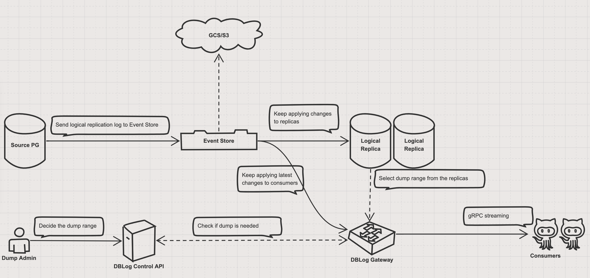

# pgcapture

A scalable Netflix DBLog implementation for PostgreSQL


[](https://codeclimate.com/github/rueian/pgcapture/maintainability)
[](https://codeclimate.com/github/rueian/pgcapture/test_coverage)



## Features
* DDL commands are also captured
* One unified gRPC Streaming API for consuming the latest changes and on-demand dumps
* The changes and dumps are streamed in Postgres Binary Representation to save bandwidth

## Improvements to Netflix DBLog
* Dumps are neither queried from source database nor injected into the source CDC stream.
  Instead, They are dumped from the logical replicas and are injected into the selected downstreams by the grpc gateway service.
* Therefore, the on-demand dump process can be scaled by adding more logical replicas and consumers.
  And most importantly, dumps process will not have impact to source database as well as other downstream consumers who don't need those dumps.   
* Primary keys of tables aren't limited to be a single numeric column, because dumps are performed by PostgreSQL TID Scan instead of performed on the primary key.
  
## Use cases
* Robust Microservice Event Sourcing
* Data synchronization, Moving data to other databases (ex. for OLAP)
* Upgrade PostgreSQL with minimum downtime

## Decode Plugin
The decode plugin is a shared library that can be loaded into PostgreSQL to decode logical changes.
Currently, pgcapture can work with the following plugins:
1. pglogical_output 

     The pglogical_output plugin is come from [pglogical](https://github.com/2ndQuadrant/pglogical) which can support binary representation of the changes. In order to use pglogical_output plugin, you must install pglogical extension first. Also, pgcapture would not create pglogical local node automatically, so you must create it manually. Or you can add a [patch](hack/postgres/14/pglogical/pglogical.patch) to change pglogical source code to ignore checking local node.

2. pgoutput

     The pgoutput plugin is standard PostgreSQL plugin which can support binary representation of the changes only when PostgreSQL version >= 14. So, if you want to use pgoutput plugin, your PostgreSQL version must be >= 14. Currently, pgoutput plugin is default plugin of pgcapture.

## Dependencies
* pglogical postgresql extension (it's optional unless you want to use pglogical_output plugin)
* pgcapture postgresql extension (it's required because it captures DDL commands)

See [./hack/postgres](./hack/postgres) for installation guide of each PostgreSQL version.

## Server Side Setup

To begin consuming changes and dumps, there are some server side components should be setup first, such as:

* pg2pulsar
* apache pulsar
* dblog controller
* dblog grpc gateway server

Please checkout https://github.com/KennyChenFight/docker-pgcapture for guidance.

## Consume changes with Golang

```golang
package main

import (
    "context"
    "database/sql"

    pgtypeV4 "github.com/jackc/pgtype"
    "github.com/jackc/pgx/v5/pgtype"
    "github.com/replicase/pgcapture"
    "google.golang.org/grpc"
)

// MyTable implements pgcapture.Model interface
// and will be decoded from change that matching the TableName()
type MyTable struct {
    ID    pgtype.Int4 `pg:"id"`       // the pgtype v5 are supported, 
    Value1 pgtypeV4.Text `pg:"value1"` // the pgtype v4 are also supported,
    Value2 sql.NullString `pg:"value2"` // the field which implement sql.Scanner interface are also supported,
    Value3 string `pg:"value3"` // the golang built-in types are also supported 
    Value4 string `pg:"my_value"` // can use 'pg' tag to specify the name mapping explicitly
}

func (t *MyTable) TableName() (schema, table string) {
    return "public", "my_table"
}

func (t MyTable) MarshalJSON() ([]byte, error) {
    return pgcapture.MarshalJSON(&t) // ignore unchanged TOAST field for pgtype(v4)
}

func main() {
    ctx := context.Background()

    conn, _ := grpc.Dial("127.0.0.1:1000", grpc.WithInsecure())
    defer conn.Close()

    consumer := pgcapture.NewDBLogConsumer(ctx, conn, pgcapture.ConsumerOption{
        // the uri identify which change stream you want.
        // you can implement dblog.SourceResolver to customize gateway behavior based on uri
        URI: "my_subscription_id", 
    })
    defer consumer.Stop()

    consumer.Consume(map[pgcapture.Model]pgcapture.ModelHandlerFunc{
        &MyTable{}: func(change pgcapture.Change) error {
            row := change.New.(*MyTable) 
            // and then handle the decoded change event
			
            if row.ID.Valid {
                // handle the changed field
            }

            if row.Value1.Status == pgtypeV4.Undefined {
                // handle the unchanged toast field
            }

            return nil
        },
    })
}
```

### Handling unchanged TOAST field

Since unchanged TOAST fields will not be present in the change stream, the corresponding model fields will remain zero value.
Users should verify them by checking the field status.

When your model fields are:
1. pgtype (v4): check the status field is `pgtype.Undefined` or not.
2. pgtype (v5): check the valid field is false or not.
3. sql.Scanner: check the valid field is false or not.
4. golang built-in types: check the field is nil or not.

The `pgcapture.MarshalJSON` is a handy `json.Marshaler` that just ignore those undefined fields for pgtype(v4).
Otherwise, you need to use omitempty in json tag to ignore those fields.

## Customize the `dblog.SourceResolver`

The provided `gateway` sub command will start a gateway server with `dblog.StaticAgentPulsarResolver` which reads a static URI resolving config.
However, it is recommended to implement your own `dblog.SourceResolver` based on the URI consumer provided, 

```golang
package main

import (
    "context"
    "net"
	
    "github.com/replicase/pgcapture"
    "google.golang.org/grpc"
)

type MySourceResolver struct {}

func (m *MySourceResolver) Source(ctx context.Context, uri string) (pgcapture.RequeueSource, error) {
    // decide where to fetch latest change based on uri
}

func (m *MySourceResolver) Dumper(ctx context.Context, uri string) (pgcapture.SourceDumper, error) {
    // decide where to fetch on-demand dumps based on uri
}

func main() {
    // connect to dump controller
    controlConn, _ := grpc.Dial("127.0.0.1:10001", grpc.WithInsecure())

    gateway := pgcapture.NewDBLogGateway(controlConn, &MySourceResolver{})

    ln, _ := net.Listen("tcp", "0.0.0.0:10000")
    gateway.Serve(context.Background(), ln)
}

```

## Contributing
The project is being actively developed and looking for additional contributors and production deployments.

### Local development
In order to ensure the development environment is consistent, we use container to build, codegen, and test the project.

You can use the following commands:
```bash
# build
./dockerbuild.sh build

# codegen (generate protobuf and mock)
./dockerbuild.sh codegen

# test
./dockerbuild.sh test

# clean (remove related containers)
./dockerbuild.sh clean
```
